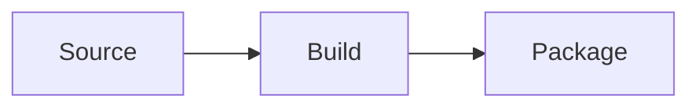
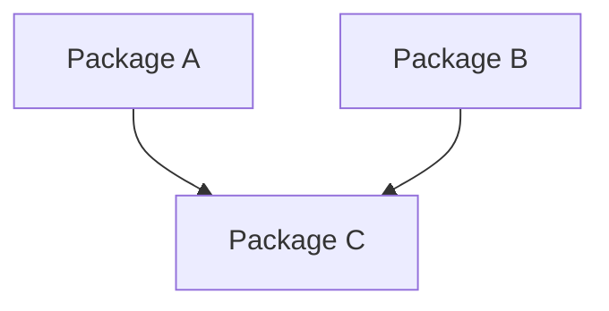
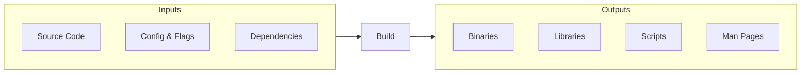
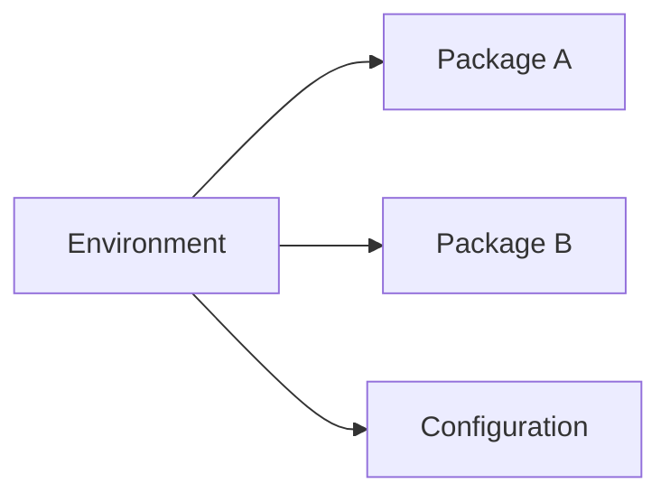
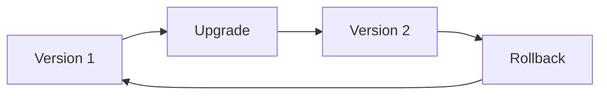

# Concepts

The [Principles](principles.md) describe *why* reproducibility, efficiency, and simplicity matter. The concepts below introduce how Flox puts the principles into practice.

## Packages

Packages are pre-built, versioned units of software ready to use.

A package is a single piece of software -- a tool, a library, a runtime -- that has been built, tested, and stored so it can be installed reliably.

## Dependencies

Dependencies are relationships between packages represented as a graph.

Software rarely stands alone. A tool may require a specific library, which in turn requires another. Dependencies describe the relationships between packages and each package version as a directed graph. 

## Builds

Builds consist of package inputs that are processed together and create package outputs.

Inputs are source code, configuration, environment variables, compiler flags, and dependencies on the outputs from other packages. Outputs are executable binaries, libraries, scripts, and other similar results of performing a build. 

## Environments

Environments are complete, portable descriptions of software.

An environment represents the graph of packages, configuration, and scripting required to use the environment. Instead of each person installing software by hand and hoping the versions match, the environment describes what is needed and produces the same result everywhere.

## Upgrades

Upgrades are safe, reversible changes to your software.

Upgrading means building new versions of packages, and updating environments to use those updated versions. If an upgrade causes a problem, roll back to a known-good state.

## Flox Platform

The concepts above are implemented in Flox as a complete platform for software lifecycle management. To see how they work in practice with specific commands and examples, continue to [Flox Platform](flox.md).
