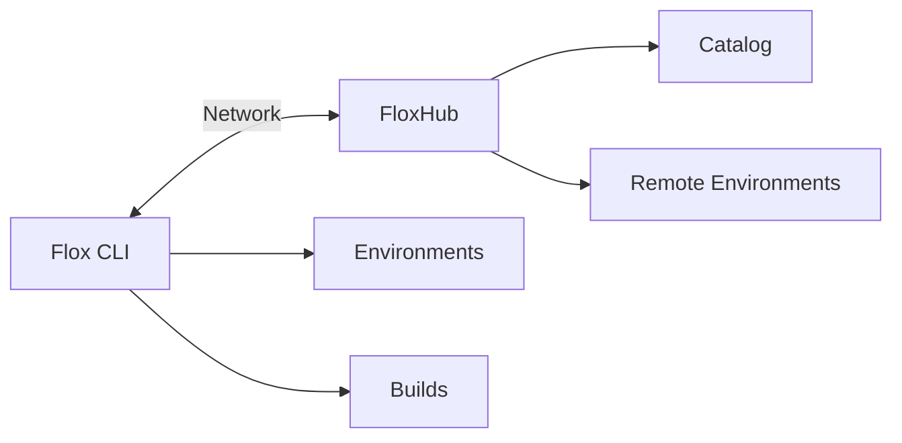
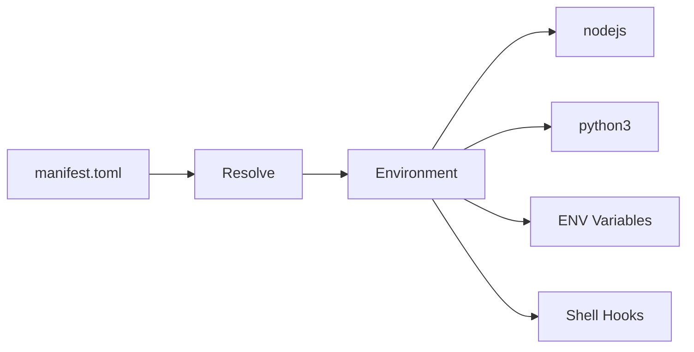
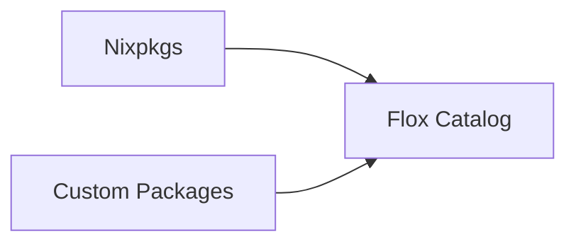
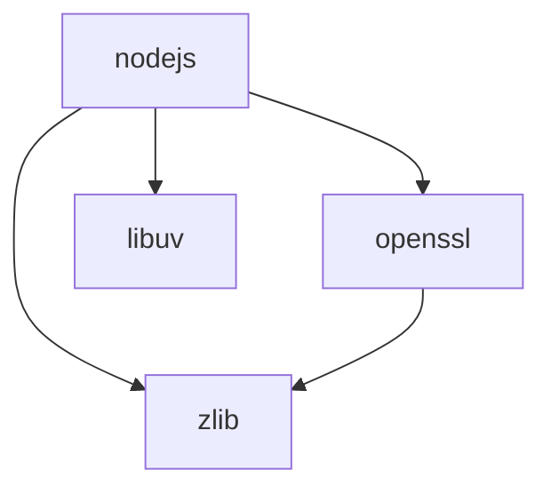
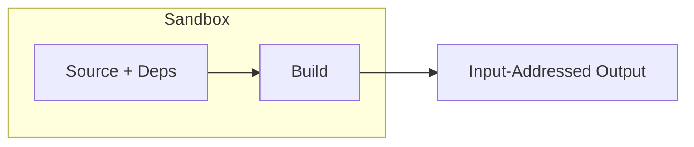
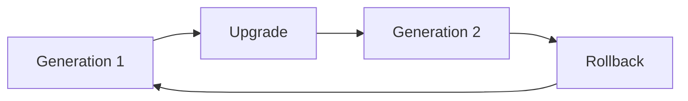

# Flox Platform

The [Concepts](concepts.md) page describes packages, dependencies, builds, environments, and upgrades. The Flox Platform implements these software concepts as a platform with structured workflows in CLI, API, and web UI.

## Client and Server

The Flox platform has both a client and server. The client is the [Flox CLI](https://flox.dev/download/) installed on each machine that interacts with Flox. The server is called [FloxHub](https://hub.flox.dev) and is the web interface and APIs invoked by the CLI.



## Environments

A Flox environment is defined by a `.flox/env/manifest.toml` file that declares the packages, configuration, environment variables, and shell hooks for a project. When you or a teammate activate the environment, Flox resolves the manifest and produces the same result. Flox CLI imperative commands also create and edit `manifest.toml` when you run `flox` commands such as: 

```
flox init
flox install nodejs python3
flox uninstall nodejs
```

The `.flox` directory is checked into version control alongside your code. Anyone who clones the repository and runs `flox activate` gets the same tools at the same versions. Environments can also be shared via FloxHub without requiring a shared repository with `flox activate -r <OWNER>/<ENVIRONMENT>`.



## Packages

Flox maintains a Package Catalog that is derived from the 120,000+ packages in [Nixpkgs](https://github.com/NixOS/nixpkgs/) -- one of the largest curated package sets available. Each package is identified by name and version, and every version is built reproducibly so that installing a package produces the same result everywhere. You can also build and publish your own packages to the Flox Catalog.



## Dependencies

When you install a package, Flox automatically resolves its full dependency graph. Every library, runtime, and tool that the package needs is included -- pinned to exact versions which are maintained in an environment lockfile at `.flox/env/manifest.lockfile`. You do not manually manage transitive dependencies; Flox guarantees that the resolved graph is complete and consistent.



This means two people installing the same package get exactly the same dependency tree -- not just the same top-level version, but the same versions of everything underneath.

## Builds

Flox builds packages in isolation using Nix. Each build runs in a sandbox with only its declared inputs available -- no network access, no untracked files from disk, no ambient system state. This is what makes builds reproducible: if the inputs have not changed, the output is identical.

The path to each output has the prefix `/nix/store/` followed by a hash of its inputs. So the entire output path looks something like `/nix/store/qclllhrddhsqs87zrjhb0rikj9vh382g-jq-1.8.1-bin`. The path to the `jq 1.8.1` binary on MacOS aarch64 is `/nix/store/qclllhrddhsqs87zrjhb0rikj9vh382g-jq-1.8.1-bin/bin/jq`.  Two builds with the same inputs always produce the same output path. This enables confident caching and sharing -- if the hash matches, the output is guaranteed identical.



## Binary Cache

Packages are pre-built and put in a nix compatible binary cache, so installation is fast. Flox prefers to download cached packages rather than building packages again from source. Some software is not cached by default as Nixpkgs has a policy to not build and cache software with non-free licenses. FloxHub enables you to build and cache packages privately for your organization.

## Upgrades

Flox environments are versioned. Each change to the manifest -- adding a package, removing one, or upgrading a version -- creates a new generation. You can upgrade packages and, if something breaks, roll back to any previous generation instantly.

```
flox upgrade nodejs
flox list --generations
flox rollback
```

Because each generation is a complete snapshot of the resolved environment, rollback is not an undo -- it is switching to a known-good state that still exists.


