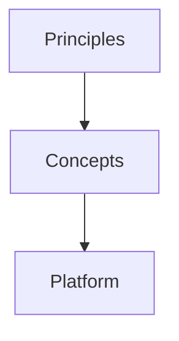
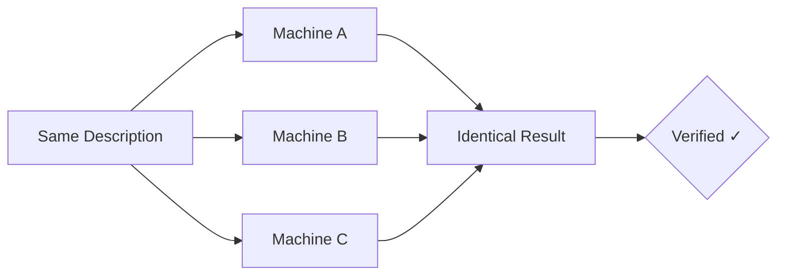
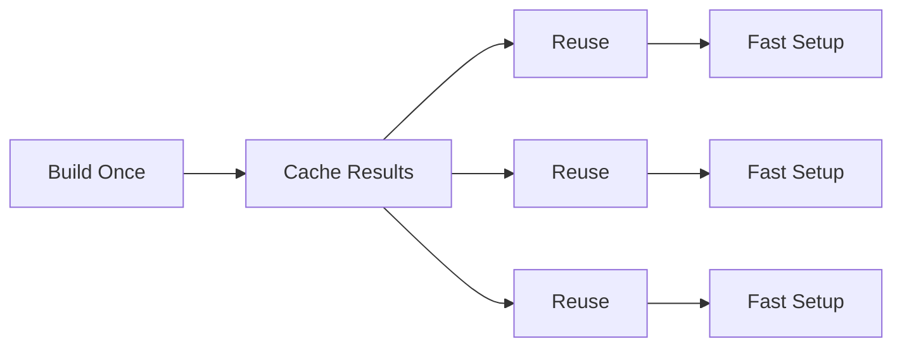
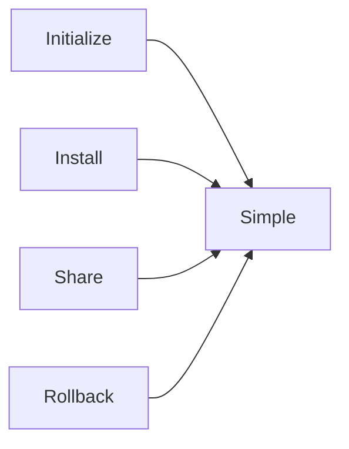

# Principles

Our mission and vision informs why we have adopted the 3 principles.

## Mission

Build the deterministic foundation for the world's software and agents.

## Vision

A world where software execution is a mathematical guarantee — everywhere, every time.

The 3 principles below, influence the concepts, which influece the platform implementation.

## 1. Reproducibility

Same inputs, same results -- and you can prove it.

When you set up software, the result should be predictable. If you and a colleague start from the same description of what's needed, you should end up with the same thing -- every time, on every machine. This is not just about convenience. It is about removing an entire class of problems where something works in one place but not another. Confidence comes from verification, so it is essential that each step in the process is verifiable.

## 2. Efficiency

Do work once. Repeatably reuse the results.

Building and configuring software takes time. Much of that time is spent repeating work that has already been done -- recompiling the same code, re-downloading the same dependencies, storing duplicate copies of something on-disk, re-running the same setup steps. If work is done once and the results are stored for reuse, every subsequent setup becomes faster. Teams spend less time waiting and more time on the work that matters.

## 3. Simplicity

Managing the software you work with should be straightforward.

Initializing a project, installing software, sharing your software with a teammate, upgrading a dependency, or rolling back a mistake -- none of these should require deep expertise or carry high risk. When common tasks are simple and safe, people are more willing to keep things up to date, experiment with improvements, and collaborate without friction.

## Principles to Concepts

These principles guide Flox concepts like environments, packages, and dependency management. To see how they translate into practice, continue to [Concepts](concepts.md).
